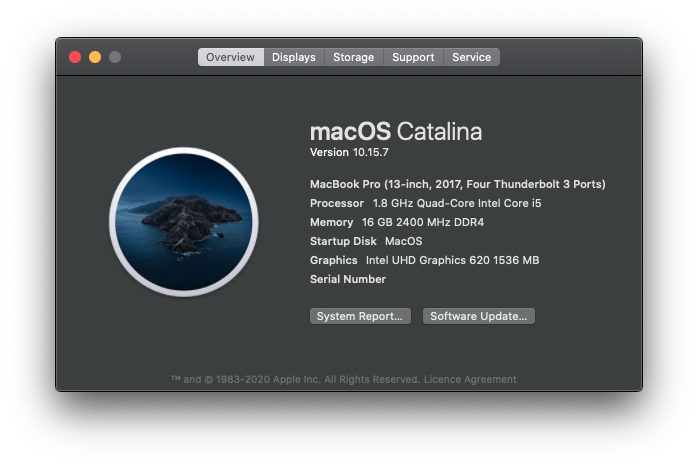

# Open core EFI for LG Gram 14z980

## Before you install 
  * Change the Serial number
  * Modify the BIOS settings (press F2 to enter the BIOS when booting, Ctrl + Alt + F7 to open the hidden BIOS options, thanks to [as695336480](https://github.com/capricornlee/LG-Gram13-Z990/issues/7#issue-624133249) for providing: source)
The following is provided by linGinc, thanks!
      1. BIOS-Main-Boot Features: CMS Support [No], Fast Boot [Disabled]
      1. BIOS-Advanced-Intel Advanced Menu-Power&Performance-CPU Power Management Control: CFG Lock [Disabled]
      1. BIOS-Advanced-System Agent(SA) Configuration: VT-d [Disabled], Above 4GB MMIO BIOS assignment [Enabled]
      1. BIOS-Advanced-System Agent(SA) Configuration-Graphics Configuration: DVMT Pre-Allocated [64M]
    
## This is what works
  * Battery patched
  * Trackpad 
  * Wifi and bluetooth using airportitilwm
    * Handoff  
    * universal clipboard
  * Side car (using wire)
  * Sleep works
  * If you want working function keys for brightness to work follow the tutorial posted by [suzuke](https://github.com/suzuke/LG-Gram-13z980-Opencore)

## This will not work
  * The airplay and wireless sidecar
  * iService may work 
  * Airdrop also won't work
  * haven't tested sd card and hdmi port

## Credits
  * Thanks [suzuke](https://github.com/suzuke/LG-Gram-13z980-Opencore) for battery ssdt
  * Thanks [Open Wireless community](https://github.com/OpenIntelWireless) for bluetooth and wifi 
  * Thanks [Opencore community](https://github.com/acidanthera/OpenCorePkg) 

## Photos
